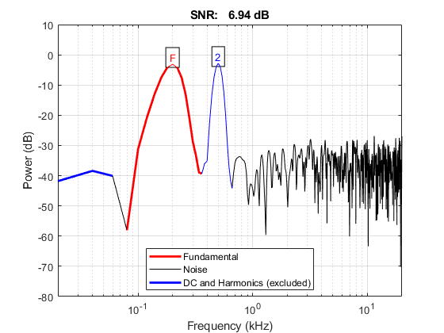

# custom_MATLAB_SNR

Custom matlab snr function for accepting only 1 harmonic, accepting given target frequency, accepting exclude PSDs below a given frequency from computing noise power forcely.

## EXAMPLE:

### MATLAB

**The following codes could be found in [example_matlab.m](./example_matlab.m)**

#### mono-frequency signal

1. Generate a signal

   ```matlab
   rng(111); % reproducability

   fs = 4e4;  % sampling rate in Hz
   t = 0:1/fs:0.05;  % sampled time points

   %% mono frequency sinusidal signal
   disp('generating mono frequency signal...')
   target_frequency = 200; % Hz
   s1_clean = sin(2*pi*target_frequency*t);

   % add noise
   target_snr = 10;
   s1 = awgn(s1_clean, target_snr, 'measured');

   % display signal in time domain
   figure;
   plot(t, s1, 'k', 'DisplayName', 'noisy signal');
   hold on
   grid on
   plot(t, s1_clean, 'r', 'LineWidth', 2, 'DisplayName', 'clean signal');
   legend('Location', 'best');
   xlabel('Time (s)')
   ylabel('Value')
   ```

   
2. Count snr

   ```matlab
   % 1 harmonic, given target frequency
   number_harmonic = 1;
   % snr(s1, fs, number_harmonic);
   custom_matlab_snr(s1, fs, number_harmonic, target_frequency);
   [snr_s1, noise_power_s1] = custom_matlab_snr(s1, fs, number_harmonic, ...
       target_frequency);
   fprintf('SNR with 1 harmonic: %.4f\n', snr_s1)

   ```

   
3. Count snr, but exclude low frequency response from counting noise power.

   ```matlab
   % 1 harmonic, given target freuency, exclude psd below 300 Hz when counting
   % noise power
   max_frequency_dc = target_frequency;  % Hz
   custom_matlab_snr(s1, fs, number_harmonic, target_frequency, max_frequency_dc);
   [snr_s1_dc, noise_power_s1_dc] = custom_matlab_snr(s1, fs, number_harmonic, ...
       target_frequency, max_frequency_dc);
   fprintf('SNR with 1 harmonic and force DC: %.4f\n', snr_s1_dc)

   ```

   
4. Compared with snr results counting from time domain:

   ```matlab
   % matlab snr from time domain results
   snr_s1_t = snr(s1, s1-s1_clean);
   fprintf('SNR from time domian: %.4f\n', snr_s1_t)
   ```

   output:

   ```
   generating mono frequency signal...
   SNR with 1 harmonic: 10.3464
   SNR with 1 harmonic and force DC: 10.3464
   SNR from time domian: 10.4806
   ```

#### multi-frequency signal

1. Generate a signal

    ```matlab
    %% multi frequency
    disp('generating dual frequency signal...')
    target_frequency2 = 500;  % Hz
    s2_clean = s1_clean + sin(2*pi*target_frequency2*t);

    % add nosie
    s2 = awgn(s2_clean, target_snr, 'measured');

    % display signal in time domain
    figure;
    plot(t, s2, 'k', 'DisplayName', 'noisy signal');
    hold on
    grid on
    plot(t, s2_clean, 'r', 'LineWidth', 2, 'DisplayName', 'clean signal');
    legend('Location', 'best');
    xlabel('Time (s)')
    ylabel('Value')
   ```

   
2. Count snr

    * frequency 1:

    ```matlab
    % 1 harmonic, given target frequencies
    disp('1 harmonic:')

    % frequency 1
    % snr(s2, fs, number_harmonic);
    custom_matlab_snr(s2, fs, number_harmonic, ...
        [target_frequency, target_frequency2]); % signal power of 2nd frequency
        % will be excluded from counting noise power (By marking it as 2nd Harmonic)
    [snr_s21, noise_power_s21] = custom_matlab_snr(s2, fs, number_harmonic,...
        [target_frequency, target_frequency2]);

    ```

    

    * frequency 2:

    ```matlab
    custom_matlab_snr(s2, fs, number_harmonic, ...
    [target_frequency2, target_frequency]);  % move target frequency to be first
    [snr_s22, noise_power_s22] = custom_matlab_snr(s2, fs, number_harmonic, ...
        [target_frequency2, target_frequency]);

    ```

    

    * overall snr:

    ```matlab
    % overall snr
    snr_s2 = mean([snr_s21, snr_s22]);
    fprintf('SNR:\n\tOverall(mean): %.4f dB\n\t%d Hz: %.4f dB\n\t%d Hz: %.4f dB\n',...
        snr_s2, target_frequency, snr_s21, target_frequency2, snr_s22);
    fprintf('\tOverall(sqrt sum square): %.4f dB\n',...
        sqrt((snr_s21^2+snr_s22^2)))

    ```

    output:

    ```
    generating dual frequency signal...
    1 harmonic:
    SNR:
        Overall(mean): 7.0789 dB
        200 Hz: 6.9433 dB
        500 Hz: 7.2145 dB
        Overall(sqrt sum square): 10.0129 dB
    ```
3. Count snr, but exclude low frequency response from counting noise power.

   * frequency 1:

   ```matlab
   % 1 harmonic, given target freuency, exclude psd below 200 Hz when counting
   % noise power
   disp('1 harmonic, exclude psd below 200 Hz when counting noise power:')
   max_frequency_dc = target_frequency;  % Hz

   % frequency 1
   custom_matlab_snr(s2, fs, number_harmonic, ...
       [target_frequency, target_frequency2], max_frequency_dc);
   [snr_s23, noise_power_s23] = custom_matlab_snr(s2, fs, number_harmonic, ...
       [target_frequency, target_frequency2], max_frequency_dc);

   ```

   

   * frequency 2:

   ```matlab
   % frequency 2
   custom_matlab_snr(s2, fs, number_harmonic, ...
       [target_frequency2, target_frequency], max_frequency_dc);
   [snr_s24, noise_power_s24] = custom_matlab_snr(s2, fs, number_harmonic, ...
       [target_frequency2, target_frequency], max_frequency_dc);

   ```

   

   * overall snr:

   ```matlab
   snr_s2_c = mean([snr_s23, snr_s24]);
   fprintf('SNR:\n\tOverall(mean): %.4f dB\n\t%d Hz: %.4f dB\n\t%d Hz: %.4f dB\n',...
       snr_s2_c, target_frequency, snr_s23, target_frequency2, snr_s24);
   fprint f('\tOverall(sqrt sum square): %.4f dB\n',...
      sqrt((snr_s23^2+snr_s24^2)))
   ```

   output:

   ```
   1 harmonic, exclude psd below 200 Hz when counting noise power:
   SNR:
       Overall(mean): 7.0786 dB
       200 Hz: 6.9430 dB
       500 Hz: 7.2142 dB
       Overall(sqrt sum square): 10.0125 dB
   ```
4. Compared with snr results counting from time domain:

   ```matlab
   % matlab snr from time domain results
   snr_s2_t = snr(s2, s2-s2_clean);
   fprintf('SNR from time domian: %.4f\n', snr_s2_t)
   ```

   output:

   ```
   SNR from time domian: 10.3977
   ```

## PYTHON

**The following codes could be found in [custom_matlab_snr.py](./custom_matlab_snr.py)**

```python
    print('generating mono frequency signal...')
    fs = 4e4
    t = np.arange(1/fs, 0.05, 1/fs)  # seconds
    f = 200

    clean = np.sin(2 * np.pi * f * t)
    np.random.seed(111)  # reproducability

    def awgn(s, snr):
        # https://stackoverflow.com/a/53688043
        # https://www.cnblogs.com/skykill/p/7474136.html
        # Convert to linear Watt units
        ps_vs_pn = 10 ** (snr / 10)
        signal_power = np.sum(s ** 2) / len(s)
        nosie_power = signal_power / ps_vs_pn
        # Generate noise samples
        mean_noise = 0
        noise = np.random.normal(
            mean_noise, np.sqrt(nosie_power), len(s))
        return s + noise

    target_snr = 10  # dB
    signal = awgn(clean, target_snr)

    plt.plot(t, signal, c='k', label='signal')
    plt.plot(t, clean, c='r', label='clean')
    plt.xlabel('Time (s)')
    plt.ylabel(r'Value')
    plt.title(f'signal SNR={target_snr :.4f} dB')
    plt.legend()
    plt.grid()
    plt.show()

    all_snr = snr_helper(
        waveform=np.reshape(signal, [1, -1]),
        sampleRate=fs,
        numberHarmonics=1,
        targetFrequency=np.ones([1, 1]) * f,
        isPlot=True,
        isLogScale=True
    )
    print(f'snr of 1 harmonic: {all_snr[0, 0]} dB')

    # snr from time domain
    snr_t = 10 * np.log10(
        (np.sum(signal ** 2) / len(signal)) /
        (np.sum((signal-clean) ** 2) / len(signal))
    )
    print(f'SNR from time domain: {snr_t:.4f} dB')

    # dual frequency
    print('generating dual frequency signal...')
    f2 = 500
    clean2 = np.sin(2 * np.pi * f2 * t) + clean
    signal2 = awgn(clean2, target_snr)

    plt.plot(t, signal2, c='k', label='signal')
    plt.plot(t, clean2, c='r', label='clean')
    plt.xlabel('Time (s)')
    plt.ylabel(r'Value')
    plt.title(f'signal SNR={target_snr :.4f} dB')
    plt.legend()
    plt.grid()
    plt.show()

    all_snr = snr_helper(
        waveform=np.reshape(signal2, [1, -1]),
        sampleRate=fs,
        numberHarmonics=1,
        targetFrequency=np.array([[f, f2]]),
        isPlot=True,
        isLogScale=True
    )
    mean_snr = np.mean(all_snr)
    print(f'SNR:\n\toverall (mean): {mean_snr} dB'
            f'\n\t{f} Hz: {all_snr[0, 0]} dB'
            f'\n\t{f2} Hz: {all_snr[0, 1]} dB')
    
    sqrt_sum_square_snr = np.sqrt(np.sum(np.square(all_snr)))
    print(f'\toverall (sqrt sum square): {sqrt_sum_square_snr} dB')

    # snr from time domain
    snr_t = 10 * np.log10(
        (np.sum(signal2 ** 2) / len(signal2)) /
        (np.sum((signal2 - clean2) ** 2) / len(signal2))
    )
    print(f'SNR from time domain: {snr_t:.4f} dB')
```


output:

```
generating mono frequency signal...
snr of 1 harmonic: 10.503775172600168 dB
SNR from time domain: 10.4778 dB
generating dual frequency signal...
SNR:
	overall: 6.94580441953717 dB
	200 Hz: 6.976787517223854 dB
	500 Hz: 6.9148213218504875 dB
    overall (sqrt sum square): 9.822948537664681 dB
SNR from time domain: 10.5996 dB
```
